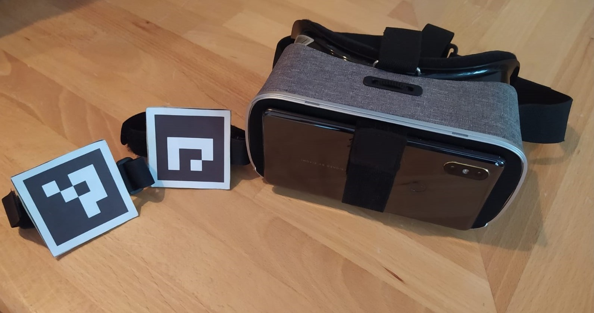

# UnityHandTracking

An example for marker based hand tracking in Unity for Android

<em>-----------------------------------------------------English version-----------------------------------------------------</em>

<em>App is only available in German.</em>
 

This project was part of a special exam in my final school tests.

It was created with Unity 2019.2.7f2 and tested on a Xiaomi Mi Mix 2S with Android 10. 

In this project I developed an android app, that allows you to interact with a DNA and an information panel through your own hands. For the Hand tracking you need 2 special Markers. You find the Instructions for the Markers in the /HandInteractionOnDNA/Setup.pdf file. 
To use this project, you need to add the OpenCV package for Unity. I used OpenCV for Unity 2.3.2.

A full documentation(!in german) can be requested under following email address: daniel.kosin04@gmail.com.
 
 

<em>----------------------------------------------------deutsche Version----------------------------------------------------</em>
 

Dieses Projekt war Teil meiner Besonderen Lernleistung fürs Abitur.

Es wurde mit Unity 2019.2.7f2 erstellt und auf dem Xiaomi Mi Mix 2S mit der Android Version 10 getestet. 

In diesem Projekt habe ich eine Android App erstellt, mit der man durch die eigenen Hände mit einer DNA und einem Informationspanel interagieren kann. Für das Hand Tracking werden 2 spezielle Marker benötigt. Die Anleitung dazu findet sich in der /HandInteractionOnDNA/Setup.pdf-Datei. 
Um das Projekt nutzen zu können, musst du OpenCV for Unity hinzufügen. Ich habe OpenCV for Unity 2.3.2 verwendet.

Eine volle Dokumentation kann über folgende E-Mail angefordert werden: daniel.kosin04@gmail.com.
